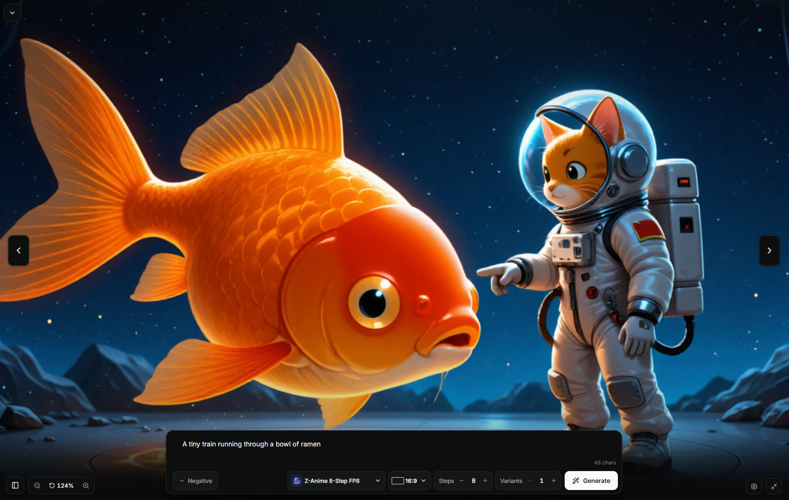
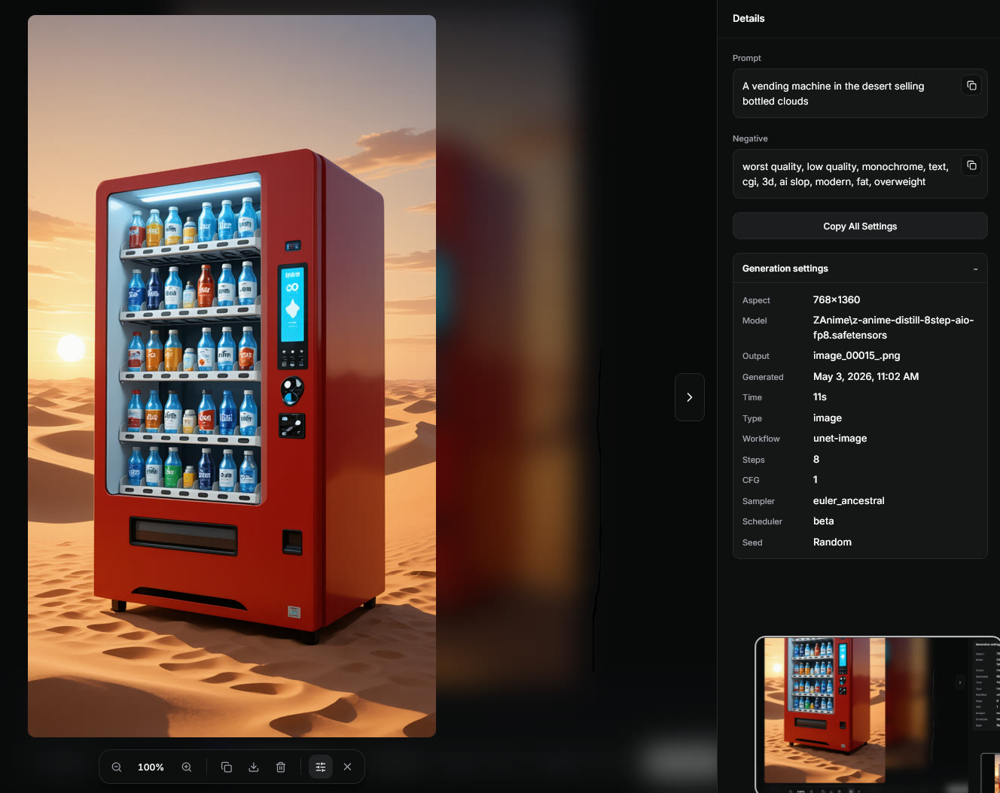
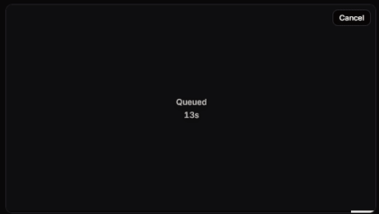

<p align="center">
  
</p>

<h1 align="center">J AI Studio</h1>

<p align="center">A simple local image and video UI for ComfyUI, without the graph editor.</p>

<p align="center">
  <a href="#quick-start">Quick start</a>
  ·
  <a href="#ai-install-prompt">AI install prompt</a>
  ·
  <a href="#update">Update</a>
  ·
  <a href="#features">Features</a>
  ·
  <a href="#comfyui">ComfyUI</a>
  ·
  <a href="#license">License</a>
</p>

## Preview

### Zen mode

Fullscreen prompt-first generation.



### Fullscreen details

Inspect an output and copy its settings.



### Realtime generation

Live ComfyUI previews while an image is running.

<a href="./docs/screenshots/realtime-generation.mp4"></a>

## Features

- Prompt-first image and video generation
- Model-aware controls from ComfyUI node metadata
- Image and video galleries kept separate by mode
- Zen mode for a cleaner fullscreen workflow
- Live queue/progress cards with cancel controls
- Persistent local gallery metadata

## Quick Start

J AI Studio expects ComfyUI to already be installed and running.

```bash
npm install
npm run build
npm start
```

Open:

```text
http://127.0.0.1:8787
```

By default, the app connects to ComfyUI at:

```text
http://127.0.0.1:8188
```

## AI Install Prompt

Paste this into Codex, Claude Code, or another local coding agent:

```text
Install and run J AI Studio from GitHub: https://github.com/jasperdevs/J-AI-Studio

Please do the full local setup for me:

1. Check whether Node.js 20+ is installed.
2. Check whether ComfyUI is installed and running at http://127.0.0.1:8188.
3. If ComfyUI is not running, help me start my existing ComfyUI install. Do not download models unless I explicitly ask.
4. Clone https://github.com/jasperdevs/J-AI-Studio into a normal projects folder.
5. Run npm install.
6. Copy .env.example to .env only if configuration changes are needed.
7. Set COMFY_URL to my ComfyUI URL, usually http://127.0.0.1:8188.
8. Run npm run build.
9. Start the app with npm start.
10. Open http://127.0.0.1:8787 and verify the app can reach ComfyUI, detect models, and load the gallery.

Keep everything local. Do not expose HOST=0.0.0.0 unless I ask for phone or LAN access. If something fails, read the error, check ComfyUI /object_info and /system_stats, and fix the setup instead of guessing.
```

## Requirements

- Node.js 20 or newer
- A running ComfyUI server
- Local ComfyUI model files

## Update

```bash
git pull
npm install
npm run build
npm start
```

To check dependency updates:

```bash
npm run check:updates
```

## ComfyUI

J AI Studio runs on top of ComfyUI. It reads available models, samplers, schedulers, size limits, prompt limits, text encoders, and VAEs from your local ComfyUI server where ComfyUI exposes them.

It does not replace ComfyUI, download models, train models, patch your ComfyUI install, or maintain a separate model runtime. ComfyUI remains the source of truth for installed nodes, model files, queue execution, previews, and output files.

<details>
<summary>Model support</summary>

The app is meant to be a simpler front end for common ComfyUI image and video generation, not a replacement for the graph editor.

Models appear when J AI Studio can detect enough ComfyUI metadata to build a generation workflow for them. If a model needs a custom graph, custom nodes, or special wiring, open it in ComfyUI first and confirm the required nodes are installed.

Generated files and model files stay local in your ComfyUI setup.

</details>

<details>
<summary>Configuration</summary>

Copy `.env.example` to `.env` if you need different ports or paths.

```bash
COMFY_URL=http://127.0.0.1:8188
HOST=127.0.0.1
PORT=8787
JAI_DATA_DIR=./data
COMFY_OUTPUT_DIR=
```

`COMFY_OUTPUT_DIR` is optional. Set it only if you want the app's output-folder button to open a specific ComfyUI output directory.

</details>

<details>
<summary>Local network hosting</summary>

For another device on your network, set:

```bash
HOST=0.0.0.0
```

Then open the selected `PORT` in your firewall. Only do this on a trusted network.

</details>

<details>
<summary>Windows shortcut example</summary>

You can make a shortcut that starts ComfyUI, starts J AI Studio, and opens the browser.

```powershell
$appRoot = "C:\path\to\J-AI-Studio"
$comfyRoot = "C:\path\to\ComfyUI"
$python = "C:\path\to\python.exe"

if (-not (Get-NetTCPConnection -LocalPort 8188 -State Listen -ErrorAction SilentlyContinue)) {
  Start-Process $python "main.py --listen 127.0.0.1 --port 8188 --disable-auto-launch" -WorkingDirectory $comfyRoot -WindowStyle Hidden
}

if (-not (Get-NetTCPConnection -LocalPort 8787 -State Listen -ErrorAction SilentlyContinue)) {
  Start-Process node "server/index.js" -WorkingDirectory $appRoot -WindowStyle Hidden
}

Start-Process "http://127.0.0.1:8787/"
```

</details>

## Development

```bash
npm install
npm run dev
```

The dev command starts Vite and the local API server together.

## Contributing

See [CONTRIBUTING.md](./CONTRIBUTING.md). Do not commit generated media, local model files, logs, or `.env` files.

## Troubleshooting

If no models appear, make sure ComfyUI is running and that `COMFY_URL` points to the right server.

If generation fails, confirm the selected model works in ComfyUI and that any required custom nodes are installed.

If video is missing, confirm your ComfyUI install has video generation nodes available.

## License

MIT
