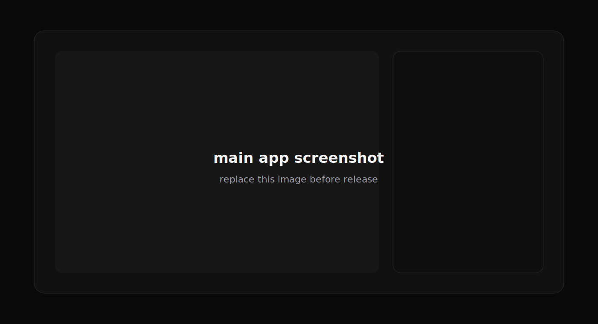
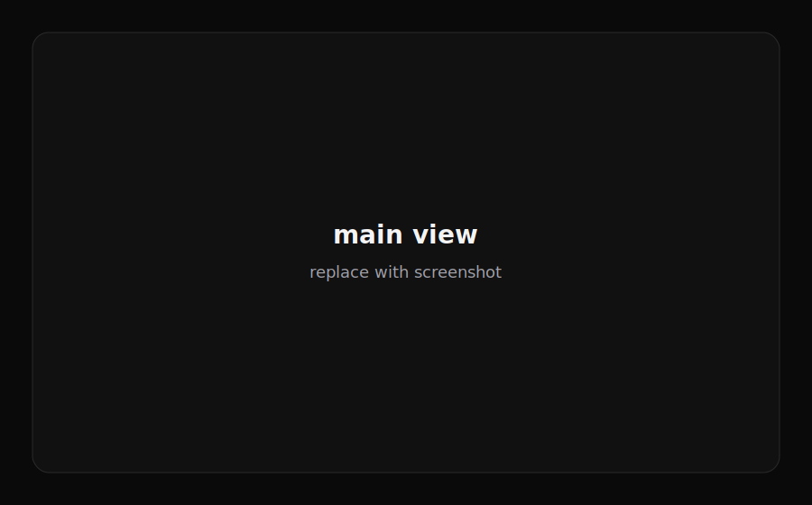
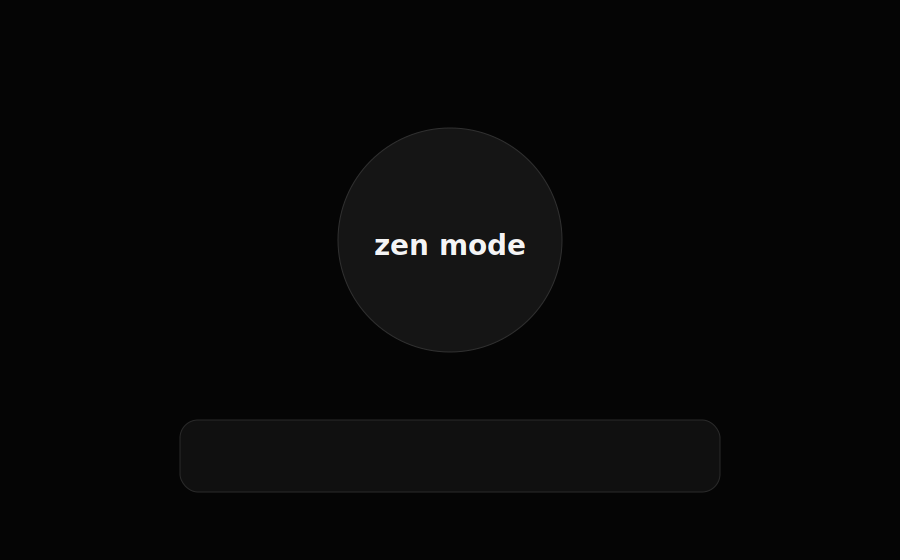
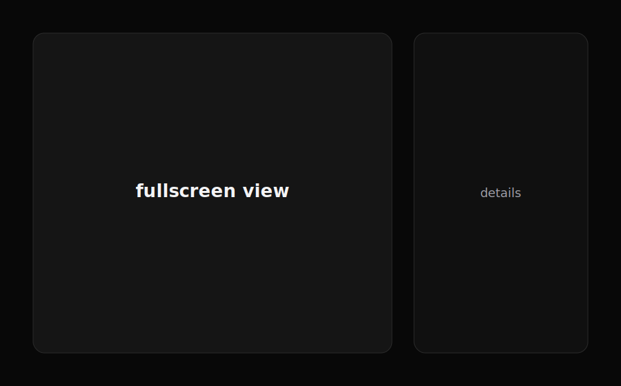
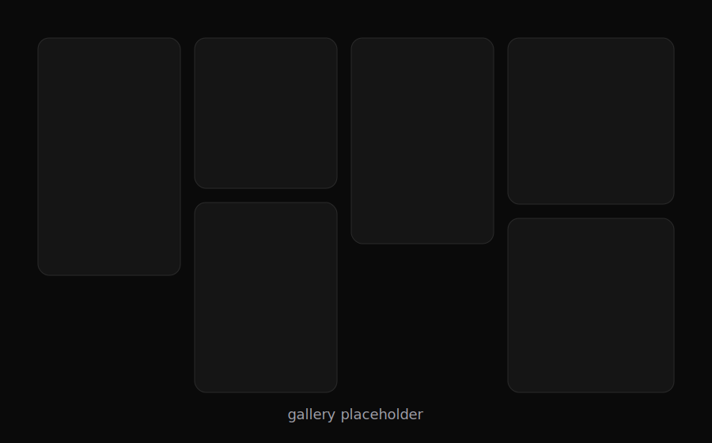
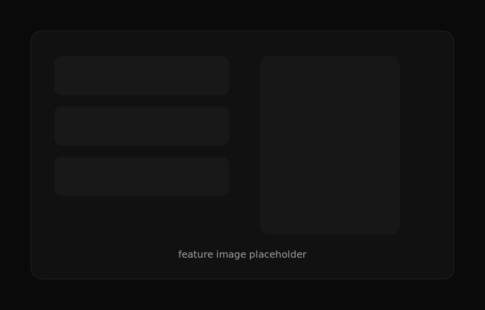

<p align="center">
  
</p>

<h1 align="center">J AI Studio</h1>

<p align="center">A simple local image and video UI for ComfyUI, without the graph editor.</p>

<p align="center">
  <a href="#quick-start">Quick start</a>
  ·
  <a href="#features">Features</a>
  ·
  <a href="#comfyui">ComfyUI</a>
</p>

<!-- Replace docs/screenshots/hero-placeholder.svg with the main app screenshot. -->

## Preview

| Main view | Zen mode |
| --- | --- |
|  |  |

| Fullscreen details | Queue and gallery |
| --- | --- |
|  |  |

## Features

<table>
  <tr>
    <td width="45%" valign="top">
      <ul>
        <li>Prompt-first image and video generation</li>
        <li>Model-aware controls from ComfyUI node metadata</li>
        <li>Image and video galleries kept separate by mode</li>
        <li>Zen mode for a cleaner fullscreen workflow</li>
        <li>Live queue/progress cards with cancel controls</li>
        <li>Persistent local gallery metadata</li>
      </ul>
    </td>
    <td width="55%" valign="top">
      
    </td>
  </tr>
</table>

<!-- Replace docs/screenshots/features-placeholder.svg with a focused feature screenshot or collage. -->

## Quick Start

J AI Studio expects ComfyUI to already be installed and running.

```bash
npm install
npm run build
npm start
```

Open:

```text
http://127.0.0.1:8787
```

By default, the app connects to ComfyUI at:

```text
http://127.0.0.1:8188
```

## Requirements

- Node.js 20 or newer
- A running ComfyUI server
- Local ComfyUI model files

J AI Studio does not download models, include models, or publish generated outputs. Models stay in your ComfyUI install. Generated files stay in ComfyUI's output folder.

## ComfyUI

The model picker lists supported workflow profiles, not every raw model file. A model appears when J AI Studio can match it to a workflow the app knows how to run.

<details>
<summary>Supported workflow profiles</summary>

Image workflows:

- Z-Image / Z-Anime-style UNET workflows using `UNETLoader`, `CLIPLoader`, `VAELoader`, `EmptySD3LatentImage`, `KSampler`, `VAEDecode`, and `SaveImage`
- Checkpoint workflows using `CheckpointLoaderSimple`, `EmptyLatentImage`, `KSampler`, `VAEDecode`, and `SaveImage`

Video workflows:

- Wan-style video workflows using `Wan22ImageToVideoLatent`, `CreateVideo`, and `SaveVideo`

The app detects available text encoders, VAEs, CLIP types, weight dtypes, samplers, schedulers, size ranges, and prompt limits from ComfyUI's `/object_info` response where ComfyUI exposes them.

</details>

<details>
<summary>Configuration</summary>

Copy `.env.example` to `.env` if you need different ports or paths.

```bash
COMFY_URL=http://127.0.0.1:8188
HOST=127.0.0.1
PORT=8787
JAI_DATA_DIR=./data
COMFY_OUTPUT_DIR=
```

`COMFY_OUTPUT_DIR` is optional. Set it only if you want the app's output-folder button to open a specific ComfyUI output directory.

</details>

<details>
<summary>Local network hosting</summary>

For another device on your network, set:

```bash
HOST=0.0.0.0
```

Then open the selected `PORT` in your firewall. Only do this on a trusted network.

</details>

<details>
<summary>Windows shortcut example</summary>

You can make a shortcut that starts ComfyUI, starts J AI Studio, and opens the browser.

```powershell
$appRoot = "C:\path\to\J-AI-Studio"
$comfyRoot = "C:\path\to\ComfyUI"
$python = "C:\path\to\python.exe"

if (-not (Get-NetTCPConnection -LocalPort 8188 -State Listen -ErrorAction SilentlyContinue)) {
  Start-Process $python "main.py --listen 127.0.0.1 --port 8188 --disable-auto-launch" -WorkingDirectory $comfyRoot -WindowStyle Hidden
}

if (-not (Get-NetTCPConnection -LocalPort 8787 -State Listen -ErrorAction SilentlyContinue)) {
  Start-Process node "server/index.js" -WorkingDirectory $appRoot -WindowStyle Hidden
}

Start-Process "http://127.0.0.1:8787/"
```

</details>

## Development

```bash
npm install
npm run dev
```

The dev command starts Vite and the local API server together.

## Troubleshooting

If no models appear, make sure ComfyUI is running and that `COMFY_URL` points to the right server.

If generation fails, confirm the selected model works with the selected text encoder and VAE in ComfyUI.

If video is missing, confirm your ComfyUI install has the required Wan video nodes available.
